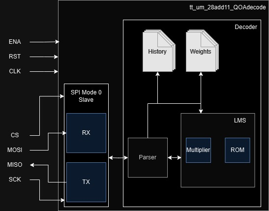

<!---

This file is used to generate your project datasheet. Please fill in the information below and delete any unused
sections.

You can also include images in this folder and reference them in the markdown. Each image must be less than
512 kb in size, and the combined size of all images must be less than 1 MB.
-->

## How it works

This chip decoded the QOA audio format, which is designed to be a simple, portable format for 16 bit PCM audio data. The specification is one page, and is availible at [qoaformat.org](https://qoaformat.org/). The chip communicates through an SPI slave mode 0 interface to a controller chip, which handles the file interface and all adjecent functions. The chip only handles decoding samples into their 16 bit uncompressed versions. 

### Block diagram

The chip itself consists of two main parts, an SPI interface for communication, and the decoder itself. The decoder contains a parser for the SPI data, the LMS predictor/updater at the heart of the QOA format, and the history/weights for the LMS predictor. 
For die area savings, we use a sequential multiplier in the LMS predictor, and save on the expensive dequantizing computations by using a precalculated table in the [reference code on Github](https://github.com/phoboslab/qoa). This ROM also takes half the size of that in the original code, because half of the values are just their negative counterpart so we just flip the sign.

## How to test

Connect the chip to a mode 0 SPI master, with a clock rate at least 6x slower than the chip clock. Then, fill the LMS history and weights, by using the following instruction:
| bit[7] | bit[6] | bit[5] | bit[4] | bit[3] | bit[2] | bit[1] | bit[0] |
| ------ | ------ | ------ | ------ | ------ | ------ | ------ | ------ |
|   0   |      |      |      | Adress[1] | Adress[0] | BankSel |   0    |

BankSel chooses between history and weights, 1 for weights and 0 for history. Adress is just which of the 4 values to fill, as specified by QOA. The next two bytes are the data to fill the history or weights with, MSB first.
If you want to then send a sample, the following instruction is used:
| bit[7] | bit[6] | bit[5] | bit[4] | bit[3] | bit[2] | bit[1] | bit[0] |
| ------ | ------ | ------ | ------ | ------ | ------ | ------ | ------ |
| sf_quant[3] | sf_quant[2] | sf_quant[1] | sf_quant[0] | qr[2] | qr[1] | qr[0] |   1    |

qr and sf_quant are exactly as they are in the QOA specification, with this chip decoding sample by sample.

After sending the sample, wait 40 chip clock cycles, then request the sample with the following instruction:
| bit[7] | bit[6] | bit[5] | bit[4] | bit[3] | bit[2] | bit[1] | bit[0] |
| ------ | ------ | ------ | ------ | ------ | ------ | ------ | ------ |
|   1    |        |        |        |        |        |        |   0    |

Once you send that instruction, the next two bytes sent by the chip will be the decoded sample, MSB first.
While you are reciving the sample, you can send any data, but it will be ignored. The chip will send unknown data when the instruction is not used.

Eventually I will get arould to writing code for the interface on [my Github](https://github.com/28add11), please look back there for updates.

## External hardware

Since this is a co-processor for the QOA format, a seperate microcontroller is required to interface with it. Since I am used to the RP2040, I will likely provide firmware for it on my Github in the future. Because this is also an audio decoder, you will need some space to put the actual audio file, so a PC to convert/store audio data for testing is also reccomended. 